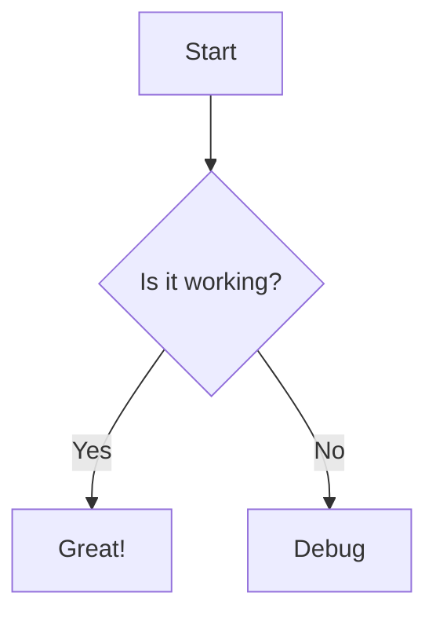

# Mermaid Graphs

Kiln includes native support for [Mermaid.js](https://mermaid.js.org/), allowing you to create complex diagrams and visualizations using simple text-based syntax.

Just like in Obsidian, you can define flowcharts, sequence diagrams, Gantt charts, and more directly within your Markdown files.

## Usage

To create a diagram, create a code block and specify `mermaid` as the language.

````markdown

````


## Performance & Optimization

Mermaid is a powerful library, but it can be heavy. Kiln optimizes this using a **Lazy Loading** strategy to ensure your site remains lightning fast.

* **Conditional Loading:** The Mermaid JavaScript library (approx. 800KB) is *only* downloaded if the specific page you are visiting actually contains a diagram.
* **Zero Blocking:** If a diagram is present, the script loads asynchronously, ensuring it never blocks the initial page render.

## Theme Adaptation

Kiln integrates Mermaid directly with its theming engine.

* **Auto-Theming:** Diagrams automatically adjust their colors to match your site's Light or Dark mode.
* **Dynamic Switching:** If a user toggles the theme while viewing a page, the diagrams will automatically re-render in real-time to match the new aesthetic.

## Supported Diagram Types

Kiln supports all standard Mermaid diagram types, including:

* **Flowcharts** (`graph TD`)
* **Sequence Diagrams** (`sequenceDiagram`)
* **Class Diagrams** (`classDiagram`)
* **State Diagrams** (`stateDiagram`)
* **Entity Relationship Diagrams** (`erDiagram`)
* **Gantt Charts** (`gantt`)
* **Pie Charts** (`pie`)
* **Mindmaps** (`mindmap`)